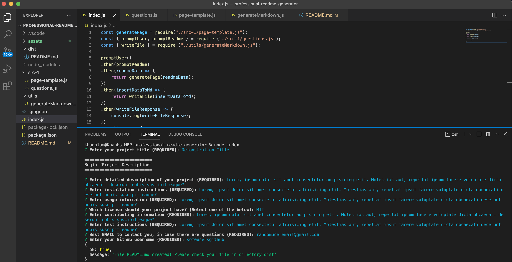

# Professional README.MD Generator

## Description
When creating an open source project on GitHub, it’s important to have a high-quality README for the app. This should include what the app is for, how to use the app, how to install it, how to report issues, and how to make contributions—this last part increases the likelihood that other developers will contribute to the success of the project.

You can quickly and easily generate a README file by using a command-line application to generate one. This allows the project creator to devote more time working on the project.

This project creates a command-line application that dynamically generates a professional README.md file from a user's input using the [Inquirer package](https://www.npmjs.com/package/inquirer).

## Table of Contents

* [Installation](#installation)
* [Usage](#usage)
* [License](#license)
* [Contributing](#contributing)
* [Tests](#tests)
* [Questions](#questions)
* [Links](#links)

## Installation

To use this application, please follow the following steps:
- Clone the repository using SSH - 'git clone git@github.com:khanhlam90/professional-readme-generator.git'
- Run npm to install the inquirer dependencies - 'npm install inquirer'

## Usage 
After the installation, please follow:
- Run 'node index.js' or simply 'node index'
- Answer prompts qyestion as detailed as possible to generate a concise and profssional README.md
- At the end of the prompts, a successful message will appear
- Navigate to root directory and access into sub-directory named 'dist' - your README.md file is placed in there.
- Keep in mind that users always have to preview the just-created version of the file for correction, such as spellings, grammars, details, etc.

## License

This project is using the MIT License.

## Contributing

Please feel free to contribute to this project - please find my info at the [Questions](#questions) section and contact me for more infomation.

## Tests

Please refer to [Usage](#usage) section.

## Questions

Please reach me using:

<a href = "mailto:khanhlam1990@yahoo.com"> My Email </a>

[My Github Account](https://github.com/khanhlam90)

## Project Links:
* [Demostration Video](./assets/video/readme-demonstration.mov)
* [Sample README.md](./dist/README.md)
* [Github Repository](#https://github.com/khanhlam90/professional-readme-generator.git)

